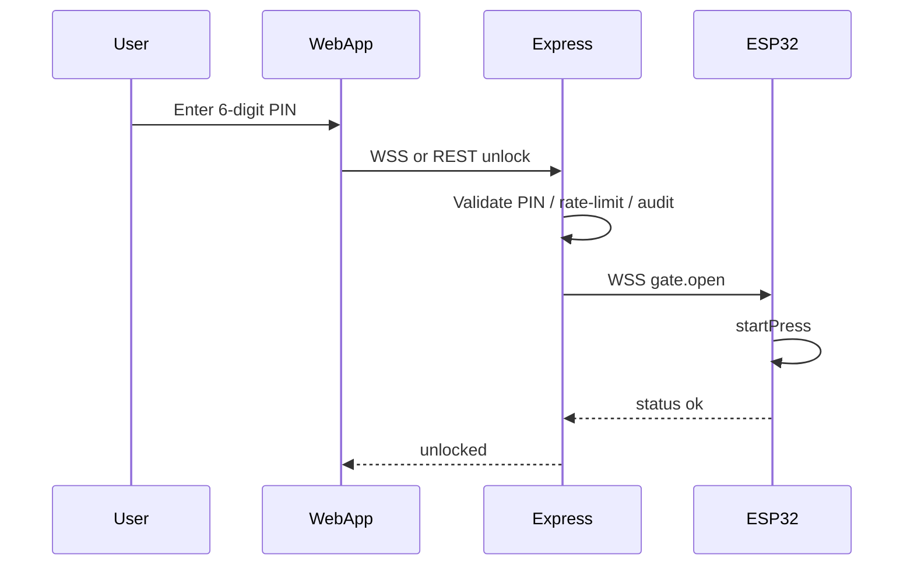

# WebSocket PIN web app (future)

How to build a web application where users enter a 6‑digit PIN and, on success, the gate opens — once GateBot is on home Wi‑Fi (**STA mode**).

This document is a **design guide**. The Express/WebSocket server and browser app are not in the firmware yet. Local unlock today remains:

`POST http://<device-ip>/api/v1/unlock` with `{ "pin": "123456" }`.

## Why STA mode first

The ESP32 must join your router (**Admin → Network → Wi‑Fi**) so it can open an **outbound** `wss://` connection to your cloud host. No port forwarding on the apartment router is required.

## Recommended architecture



| Piece | Responsibility |
|-------|----------------|
| **React (or any) web app** | PIN keypad UI; talks only to your HTTPS API |
| **Express** | Auth, PIN validation, audit log, WebSocket hub |
| **ESP32** | Persistent WSS client; on `gate.open` run existing press sequence |

Do **not** put the SoftAP admin password in the public web app. Use a **device ID + device secret** registered in your database.

## Message schemas (suggested)

### Browser → Express (WSS)

```json
{ "type": "unlock", "pin": "123456", "deviceId": "gatebot-living" }
```

### Express → ESP32 (WSS)

```json
{ "type": "gate.open", "requestId": "uuid-…" }
```

### ESP32 → Express

```json
{ "type": "status", "requestId": "uuid-…", "ok": true, "busy": false, "angle": 40 }
```

### Express → browser

```json
{ "type": "unlock.result", "ok": true }
```

REST alternative for the browser (simpler to start):

`POST https://api.example.com/api/unlock`  
`{ "pin": "123456", "deviceId": "…" }`  
→ server validates PIN → sends `gate.open` on the device socket.

## ESP32 client sketch (later firmware)

Once STA is connected:

```cpp
// Pseudocode
webSocket.beginSSL("api.example.com", 443, "/device");
webSocket.setAuthorization(DEVICE_ID, DEVICE_SECRET);

void onMessage(uint8_t* payload) {
  // parse JSON; if type == "gate.open" → startPress();
}
```

Reconnect with exponential backoff when Wi‑Fi or WSS drops.

## Same-LAN option (no cloud)

If the phone is on the same Wi‑Fi as the ESP32:

```js
await fetch(`http://${espLanIp}/api/v1/unlock`, {
  method: 'POST',
  headers: { 'Content-Type': 'application/json' },
  body: JSON.stringify({ pin: '123456' })
});
```

Use the **Public unlock URL** from Admin → Network after STA connects. Mixed-content rules: a page served over HTTPS cannot call `http://` LAN IPs — use HTTP pages on LAN, or a cloud proxy.

## Express sketch

```js
// POST /api/unlock
app.post('/api/unlock', async (req, res) => {
  const { pin, deviceId } = req.body;
  if (!(await pinsValid(deviceId, pin))) return res.status(401).json({ ok: false });
  const sock = devices.get(deviceId);
  if (!sock) return res.status(503).json({ ok: false, error: 'device offline' });
  sock.send(JSON.stringify({ type: 'gate.open', requestId: crypto.randomUUID() }));
  res.json({ ok: true });
});
```

PINs can live in MongoDB (cloud) or you can proxy unlock to the device’s existing `/api/v1/unlock` if the server can reach the ESP (usually it cannot from the public internet — prefer WSS **to** the device).

## React PIN pad sketch

```jsx
async function submitPin(pin) {
  const res = await fetch('/api/unlock', {
    method: 'POST',
    headers: { 'Content-Type': 'application/json' },
    body: JSON.stringify({ pin, deviceId: 'gatebot-living' })
  });
  const data = await res.json();
  if (!res.ok) throw new Error(data.error || 'Unlock failed');
  // show success
}
```

Or open `wss://api.example.com/ws?token=…` and send `{ type: 'unlock', pin }`.

## Checklist before building the cloud app

1. [ ] ESP in **STA** mode and online on home Wi‑Fi ([`wifi-modes.md`](./wifi-modes.md))
2. [ ] HTTPS host for Express + WSS
3. [ ] Device registry (id + secret) in DB
4. [ ] Firmware WSS client (future phase)
5. [ ] Web app PIN UI → Express → `gate.open`

## Related

- Local PIN unlock today: [`admin-pin.md`](./admin-pin.md), [`api-v1.md`](./api-v1.md)
- Dual Wi‑Fi: [`wifi-modes.md`](./wifi-modes.md)
